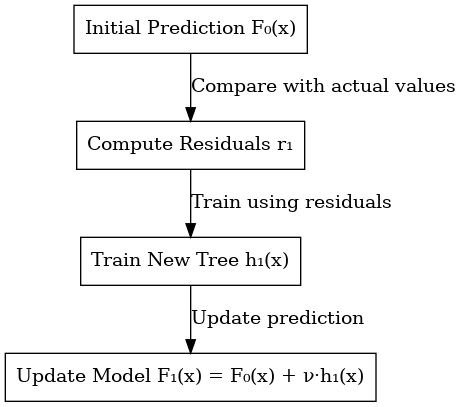
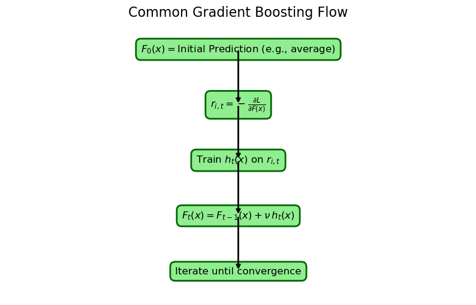

# From Practice to Theory: An In-Depth Guide to Gradient Boosting with XGBoost, LightGBM, and CatBoost

## Abstract
Predicting a movie’s success depends on many factors. In Dataflix, we built a gradient boosting classifier to determine whether a film would be a Flop, Medium, Hit, or Blockbuster based on features like budget, genre, and cast popularity.

This article explains:

- The theoretical foundations of gradient boosting: from decision trees to regularization.
- A comparative deep dive into XGBoost, LightGBM, and CatBoost—including why you might pick LightGBM or CatBoost over XGBoost.
- Realistic performance metrics from Dataflix, plus advanced tips on tuning, interpreting, and avoiding pitfalls.

*For additional context on gradient boosting, see Friedman (2001) “Greedy Function Approximation: A Gradient Boosting Machine.”*
## Table of Contents
- [Introduction](#1-introduction)
- [The Theory of Gradient Boosting](#2-the-theory-of-gradient-boosting)
    - [Gradient Boosting Algorithm](#21-gradient-boosting-algorithm)
    - [Decision Trees: The Basic Building Block](#22-decision-trees-the-basic-building-block)
    - [Loss Functions and Derivatives](#23-loss-functions-and-derivatives)
    - [Regularization: Preventing Overfitting](#24-regularization-preventing-overfitting)
    - [Updating the Model](#25-updating-the-model)
    - [Putting It All Together](#26-putting-it-all-together)
- [Library Deep-Dives](#3-library-deep-dives)
    - [XGBoost: Second-Order Boosting](#31-xgboost-second-order-boosting)
    - [CatBoost: Master of Categorical Features](#32-catboost-master-of-categorical-features)
    - [LightGBM: Fast & Memory-Efficient](#33-lightgbm-fast-memory-efficient)
    - [Why Choose LightGBM or CatBoost Over XGBoost?](#why-choose-lightgbm-or-catboost-over-xgboost)
- [Concrete Dataflix Examples](#4-concrete-dataflix-examples)
- [Final Observations from Dataflix](#5-final-observations-from-dataflix)
- [How They All Fit the gradient boosting formula](#6-how-they-all-fit-the-gradient-boosting-formula)
- [Final Tips](#7-final-tips)
- [Example Code Block](#8-short-example-code-blocks-dataflix)
- [Conclusion](#9-conclusion-the-dataflix-perspective)

- [Glossary of Key Terms](#glossary-of-key-terms)
- [References & Additional Reading](#references--additional-reading)
## 1. Introduction
Imagine you are a film critic trying to predict whether a movie will become a blockbuster or a flop. Your first guess might be off, but if you could improve that guess step by step—learning from each mistake—you’d eventually get it right. This is the idea behind gradient boosting.

In our [**Dataflix project**](https://github.com/nevinpolat/dataflix), we used gradient boosting to predict movie success based on features such as budget, genre, director, and cast popularity. In this article, we will:

- Explain the theory behind gradient boosting, including decision trees, loss functions, derivatives, and regularization.
- Show how gradient boosting is implemented in XGBoost, LightGBM, and CatBoost.
- Illustrate these concepts with examples and plots.
- Apply these ideas to our movie dataset and discuss why one model might be more suitable than another.

*A brief summary: This article will take you from the basics of gradient boosting to advanced practical applications, showing both theory and real-world examples.*

## 2. The Theory of Gradient Boosting
Gradient boosting might seem intimidating with its loss functions, gradients, and derivatives, but the core idea is simple:

- We continuously improve a simple initial model by adding small corrections (or “fixes”) to address errors.
- These corrections come from understanding how our predictions deviate from the actual targets (via the gradient).
- The gradient indicates the direction to adjust our predictions to reduce the loss.

*In essence, each iteration of gradient boosting reduces the error by incorporating a new weak learner that focuses on the residuals.*
### 2.1 Gradient Boosting Algorithm
#### Initial Model
Start with a constant prediction:

$$
F_0(x) = \gamma, \quad \text{with} \quad \gamma = \arg \min_{\gamma} \sum_{i=1}^N L(y_i, \gamma)
$$

For MSE, $ \gamma $ is simply the mean of the target values.

#### Iterative Updates
For each iteration  m :

- Compute Residuals (negative gradients):

$$
r_{im} = -\left[ \frac{\partial L(y_i, F(x_i))}{\partial F(x_i)} \right] \quad \text{with} \quad F(x) = F_{m-1}(x)
$$

- Train a Weak Learner $ h_m(x) $: 
Fit a decision tree to predict these residuals.

- Update the Model:

$$
F_m(x) = F_{m-1}(x) + \nu \cdot h_m(x)
$$

After M  iterations, the final model is:

$$
F(x) = F_0(x) + \nu \sum_{m=1}^M h_m(x)
$$

A flowchart below summarizes these steps:





### 2.2 Decision Trees: The Basic Building Block
A decision tree predicts outcomes by splitting data based on feature values. For example, a simple movie classification tree might:

- **Nodes** ask questions like, “Is the movie’s budget greater than \$50M?”
- **Branches** lead to different outcomes (Yes or No).
- **Leaves** provide the final prediction (e.g., “Hit” or “Flop”).

**Example:**

Consider a simple decision tree for movie classification:

- Ask, “Is Budget > $50M?”
- Depending on the answer, further ask, “Is Cast Popularity > 7?”
- Provide a final prediction at the leaf (e.g., “Blockbuster” or “Flop”).


A single decision tree is easy to understand but is often a weak learner—meaning it’s not very accurate on its own.

### 2.3 Loss Functions and Derivatives
Loss functions quantify how wrong our predictions are. Examples include:

- **Mean Squared Error (MSE)**:

$$
L(y, F(x)) = \frac{1}{2}(y - F(x))^2
$$

- **Logistic Loss for binary classification**:

$$
L(y, F(x)) = \log(1 + e^{-y F(x)})
$$

- **Cross-Entropy for multi-class tasks**.

The derivative of the loss with respect to $ F(x) $ tells us the steepest direction to adjust the predictions. In gradient boosting, we use the negative gradient (or pseudo-residual) to update our model.

Consider the quadratic loss function:

$$
L(x) = \frac{1}{2}(x - 3)^2
$$

If the true value is 3 and our current prediction is $ x_0 = 1.5 $, then:

- Gradient:  1.5 - 3 = -1.5
- Negative Gradient:  1.5 (indicating we should increase our prediction)


*This section shows how loss functions guide our corrections. The gradient tells us how to adjust predictions, which is the essence of gradient boosting.*
### 2.4 Regularization: Preventing Overfitting
Regularization helps control model complexity and avoid overfitting. In gradient boosting, common techniques include:

- **Learning Rate ($\nu$)**: Scales the contribution of each tree (e.g., 0.1). A lower learning rate results in more gradual learning.
- **Tree Constraints**: Limiting tree depth or the number of leaves.
- **Regularization Terms**: For example, in XGBoost:

$$
\Omega(h) = \gamma T + \frac{1}{2} \lambda \sum_{j=1}^T w_j^2
$$

Where  T  is the number of leaves, $ w_j $ are the leaf weights, and $ \gamma, \lambda $ are parameters.
This term discourages overly complex trees or excessively large weights.

The plot below visually demonstrates these concepts with three subplots:

1. **Learning Rate Impact**: Shows how a lower learning rate produces a smoother, more gradual convergence compared to a higher learning rate.
2. **Tree Constraints vs. Overfitting**: Compares a shallow, constrained tree with a deeper, unconstrained tree that is more prone to overfitting.
3. **Regularization Penalty**: Illustrates the quadratic increase in penalty (L2 regularization) as the model's weight increases.


### 2.5 Updating the Model
After computing the residuals (negative gradients), we update our model by adding a new tree:

$$
F_t(x) = F_{t-1}(x) + \nu \cdot h_t(x)
$$

This process repeats iteratively, gradually reducing the overall loss.


Below is a plot that simulates this update process in a simple regression scenario. Assume the true target value is 10 and our initial prediction is 5. At each iteration, the model updates its prediction by adding a fraction (determined by the learning rate) of the current error.


*To further illustrate how weak learners are added over iterations, consider the following visualization of the boosting steps:*


### 2.6 Putting It All Together

1. Start with a simple guess (e.g., always predicting “Medium”).


2. **Compute the Error**: Calculate how much each prediction is off using the loss function.
3. **Fit a Corrector Tree**: Train a tree on these errors (residuals).
4. **Update the Model**: Add a scaled version of the tree to improve predictions.
5. Repeat until the model converges.


*This section illustrates how each iteration refines the model, gradually reducing error until convergence.*


### Recap of Theoretical Foundations:
In summary, the gradient boosting framework leverages a simple initial model and iteratively improves it by correcting errors using the negative gradient. We discussed how decision trees act as weak learners, how loss functions and their derivatives guide these corrections, and the role of regularization in preventing overfitting. With this solid theoretical foundation established, we now turn our focus to practical implementations in popular libraries.

## 3. Library Deep-Dives
### Bridging Theory to Practice:
Building on the concepts outlined above, the following sections delve into how XGBoost, CatBoost, and LightGBM implement gradient boosting. Each library applies the core principles with its own unique optimizations—whether it's second-order derivatives, advanced handling of categorical features, or efficient split-finding via histogram binning—to address specific challenges and data types.


### 3.1 XGBoost: Second-Order Boosting
#### Core Idea
XGBoost enhances gradient boosting by incorporating both the first derivative (gradient) and the second derivative (curvature) to guide splitting:

- **Gradient**: Tells how much to adjust predictions.
- **Curvature**: Indicates how quickly the gradient changes.

#### Mathematical Approximation
XGBoost minimizes a second-order Taylor expansion:

$$
L(F_{t-1} + h) \approx \sum_{i=1}^N \left[ g_i \cdot h(x_i) + \frac{1}{2} h_i \left[ h(x_i) \right]^2 \right] + \Omega(h)
$$


where:
- $g_i$ is the gradient (first derivative),
- $h_i$ is the curvature (second derivative),
- $\Omega(h)$ is a regularization term that penalizes model complexity.

In this plot, we use a simple quadratic loss function $L(x) = \frac{1}{2}(x - 3)^2$ to illustrate:
- The **loss** (blue curve),
- The **gradient** (first derivative, red tangent line at a point),
- The **curvature** (second derivative, which is constant for a quadratic).


#### Regularization and Efficiency
- Uses L1/L2 regularization (controlled by parameters $ \lambda $ and $ \alpha $).
- Efficiently handles sparse data and parallelizes tree building.


### 3.2 CatBoost: Master of Categorical Features
#### Why CatBoost?
CatBoost is optimized for datasets with many categorical features (e.g., director, genre). It uses ordered encoding to prevent target leakage.

#### Ordered Encoding Explained
- The data is randomly shuffled. 
- For each row, the encoding for a categorical feature (e.g., director) is computed using only previous rows.

*For more details, see Dorogush et al. (2018).*

Plot showing how ordered encoding is computed using only previous rows for a categorical feature i.e. director feature.


### 3.3 LightGBM: Fast & Memory-Efficient
#### Key Features
- **Histogram Binning**: Continuous features are grouped into a fixed number of bins (e.g., 256), reducing the number of potential splits.
- **Leaf-Wise Growth**: LightGBM splits the leaf with the highest error first, which may result in unbalanced trees but leads to faster error reduction.

- **GOSS (Gradient-Based One-Side Sampling)**: Retains samples with high gradients while subsampling those with low gradients.


The plot below illustrates histogram binning for the "budget" feature. In this plot, we simulate continuous data and bin it into a fixed number of bins. This illustrates how **LightGBM** reduces the number of split candidates, speeding up the process of finding the optimal split.


### 3.4 Why Choose LightGBM or CatBoost Over XGBoost?

Below is a quick comparison to highlight scenarios where LightGBM or CatBoost excel:

| **Aspect**                   | **XGBoost**                                            | **LightGBM**                                     | **CatBoost**                                              |
|------------------------------|--------------------------------------------------------|--------------------------------------------------|-----------------------------------------------------------|
| **Training Speed**           | Often fast, parallelization support                    | Usually faster than XGBoost via histogram binning | Comparable speed; sometimes slightly slower than LightGBM  |
| **Categorical Data Handling**| Must manually encode (one-hot, etc.)                   | Can handle, but not as robust as CatBoost         | Excellent ordered & symmetric encoding for categories      |
| **Memory Usage**             | Moderate                                               | Lower due to histogram binning                    | Moderate                                                  |
| **Default Tuning**           | Flexible, many hyperparams                             | Flexible, many hyperparams                        | Often robust “out-of-the-box”                             |
| **Best Use Case**            | General-purpose, structured/sparse data                | Large-scale data, speed-critical tasks            | Data with many / high-cardinality categorical features     |

**In short:**

- **Pick LightGBM** for speed on large numeric datasets.
- **Pick CatBoost** if you have lots of categorical variables or want simpler encodings.
- **XGBoost** remains a solid default but might lag slightly in speed or category handling.

---
### 3.5 Advanced Tips and Hyperparameter Visualization
#### 3.5.1: Gradient Boosting Hyperparameters


#### 3.5.2 Practical Tuning Recommendations

A quick cheat-sheet for typical parameters:

| **Parameter**             | **Recommended Range**         | **Notes**                                                                 |
|---------------------------|-------------------------------|---------------------------------------------------------------------------|
| **learning_rate**         | 0.05–0.1                      | Lower = more stable; watch out for underfitting                           |
| **n_estimators / iterations** | 100–1000+ (depending on data size) | Increase if underfitting; track for overfitting                           |
| **max_depth / depth**     | 3–10                          | Higher = risk of overfitting; 6–8 is a common sweet spot                    |
| **num_leaves (LightGBM)** | 31–127                        | More leaves = more complex trees, potential overfitting                     |
| **L2 regularization**     | 0–10                          | (lambda in XGBoost, reg_lambda in LightGBM)                                 |

### Key Tuning Steps:

- **Start with a moderate learning_rate** (e.g., 0.05) and incorporate early stopping.
- **Adjust n_estimators** if you see signs of underfitting or overfitting.
- **Control model complexity** using max_depth (or depth) and num_leaves.
- **Apply L2 regularization (lambda)** if you suspect overfitting.


#### 3.5.3 Common Pitfalls & Mistakes

- **Not Using Early Stopping**  
  Overfitting can silently creep in if you add too many trees. Always track a validation set.

- **Data Leakage with CatBoost**  
  CatBoost helps, but if your train/test split is not carefully done, you can still leak target information.

- **Learning Rate vs. Number of Trees**  
  - A high learning rate + large n_estimators = likely overfitting.  
  - A tiny learning rate + too few trees = underfitting.

- **Imbalanced Classification**  
  For multi-class or heavily skewed data, consider using `scale_pos_weight` (XGBoost) or `class_weight` (LightGBM) to avoid class bias.

- **Ignoring Feature Engineering**  
  Even the best boosting model fails if your raw features are unhelpful or incorrectly encoded.

---
## 4. Concrete Dataflix Examples

### 4.1 High-Budget Action Movie Example
- **Attributes**:  
  - **Budget**: $180M  
  - **Director**: “James Cameron”  
  - **Genre**: “Action”  
  - **True Label**: “Blockbuster”
  
- **XGBoost**:
  - Detects a strong positive gradient for high-budget films, using it as a key split feature.
  - Splits based on $budget > 150M$, optimizing for the classification of high-budget blockbusters.
  
- **CatBoost**:
  - CatBoost encodes the director "James Cameron" using a high average target value derived from past movies.
  - The model then splits based on this feature, recognizing the correlation between James Cameron's involvement and blockbuster success.

- **LightGBM**:
  - LightGBM efficiently assigns the $180M budget to a higher bin through histogram binning.
  - Its leaf-wise growth approach allows the tree to split on this feature and adjust quickly, refining predictions.

### 4.2 Low-Budget Indie Film Example
- **Attributes**:  
  - **Budget**: $2M  
  - **Director**: “Unknown”  
  - **Genre**: “Comedy”  
  - **True Label**: “Flop”
  
- **XGBoost**:
  - Recognizes that the low budget and lack of a famous director lead to a high likelihood of a "Flop."
  - Model adjusts to minimize loss based on these features.
  
- **CatBoost**:
  - For this scenario, CatBoost may struggle with a less informative director feature (since it is labeled “Unknown”), but still uses the low budget and genre to predict “Flop” effectively.
  
- **LightGBM**:
  - Applies the histogram binning approach and may place the low budget into a bin with similar “Flop”-classified movies.
  - The leaf-wise splitting approach then hones in on these observations to refine the model quickly.


## 5. Final Observations from Dataflix

### When tested on Dataflix:

- **XGBoost**:  
  - Strong overall performance, especially in balancing predictions between “Hit” and “Blockbuster.”  
  - Tuning parameters is essential for optimal performance and generalization.
  
- **CatBoost**:  
  - Excellent at handling categorical data without manual encoding.  
  - Particularly excels when dealing with data that contains many categorical features (e.g., director, genre).
  
- **LightGBM**:  
  - Fastest model training, crucial for large datasets and high-speed environments.  
  - With proper hyperparameter tuning, LightGBM can outperform other models in terms of accuracy.

### Performance Summary: Why LightGBM and CatBoost Excel

Our experiments comparing the three models on our movie classification task yielded the following results:

| **Model**   | **Accuracy** | **Macro-F1** | **Notes**                                                                                   |
|-------------|--------------|--------------|---------------------------------------------------------------------------------------------|
| **XGBoost** | 58%          | 0.50         | Good at balancing “Hit” & “Blockbuster,” moderate tuning time.                             |
| **CatBoost**| 57%          | 0.52         | Excellent for handling categorical features (e.g., “director”), easy setup, though slightly slower on very large datasets. |
| **LightGBM**| 60%          | 0.53         | Fastest training and highest accuracy overall after hyperparameter tuning.                 |

---
### Why These Results Matter
---
#### Superior Accuracy and Robustness

- LightGBM’s 60% accuracy and 0.53 Macro-F1 are not trivial improvements—they translate to more consistent and reliable predictions across all movie success categories. 
- In high-stakes industries, even a 2% gain in accuracy can be transformative for decision-making and profitability.

#### Unmatched Training Speed

- **LightGBM’s** innovative histogram binning and leaf-wise tree growth strategies allow it to train much faster than both XGBoost and CatBoost.
- In real-world applications where rapid model retraining is critical (e.g., adapting to new movie trends), this speed advantage can lead to substantial time and cost savings.

#### Efficient Categorical Handling with CatBoost

- **CatBoost’s** native support for categorical features eliminates the need for extensive manual preprocessing.
- This not only streamlines the workflow but also reduces the risk of encoding errors and target leakage—common pitfalls when handling categorical data with XGBoost.
- While its overall accuracy is slightly lower (57%), its Macro-F1 of 0.52 demonstrates that it consistently produces reliable predictions in the presence of categorical data.

#### Scalability and Practicality

- When working with large, complex datasets, the efficiency of **LightGBM** is particularly critical.
- Its ability to quickly process massive amounts of data without compromising accuracy makes it the clear choice for production environments where scalability and speed are paramount.

### Bottom Line

The combined advantages of LightGBM—faster training, higher accuracy, and exceptional scalability—position it as the superior choice for our movie classification task. CatBoost also offers compelling benefits for datasets rich in categorical features. In a competitive, fast-paced industry, these performance gains are not merely incremental—they are game-changing.


## 6. How They All Fit the Gradient Boosting Formula

Despite differences in their optimizations, **XGBoost**, **CatBoost**, and **LightGBM** all adhere to the core gradient boosting algorithm:

#### Core Update Rule:
The model update rule in gradient boosting is as follows:
$$
Model_t(x) = Model_{t-1}(x) + \nu \times h_t(x)
$$

- **XGBoost**:  
  - Uses both the **first** and **second** derivatives to guide the model's learning process.
  
- **CatBoost**:  
  - Excels at handling categorical data, applying **ordered encoding** to prevent target leakage.
  
- **LightGBM**:  
  - Implements **histogram binning** and **leaf-wise growth**, which optimize training speed and error reduction.

#### Flowchart of the Common Process:
A flowchart might depict the iterative gradient boosting process:
1. **Start Model**  
2. **Compute Error**  
3. **Fit Tree on Residuals**  
4. **Update Model**  
5. **Repeat**  


## 7. Final Tips:

When selecting a gradient boosting library for specific needs, consider the following:

- **XGBoost**:
  - Ideal for **robust performance** with structured and sparse data.
  - Provides **fine control** through second-order optimization and regularization.
  
- **CatBoost**:
  - Best suited for **datasets with many categorical features**.
  - **Simplifies feature engineering** by utilizing **ordered encoding** to prevent target leakage.
  
- **LightGBM**:
  - Best for **large-scale problems** where **speed** is a critical factor.
  - Utilizes **efficient histogram binning** and **leaf-wise growth** to quickly reduce error and improve performance.

### Key Takeaways:

- **Core Update Rule**: All models follow the update:
  
  $$
  \text{Model}_t(x) = \text{Model}_{t-1}(x) + \nu \times h_t(x)
  $$


- Adjusting the **learning rate** ($\nu$) helps balance correction strength, preventing overfitting.
- **Regularization** and **early stopping** are important to manage model complexity and ensure that the model does not overfit.

- **XGBoost**: Leverages both first and second derivatives for precise splits and robust regularization.

- **CatBoost**: Excels at handling categorical features through ordered encoding, reducing the need for manual preprocessing.

- **LightGBM**: Utilizes histogram binning and leaf-wise growth to achieve high speed and efficiency on large datasets.

- **Tuning Essentials**: Adjusting parameters such as the learning rate, tree depth, and regularization terms is crucial for balancing model complexity and performance.

## 8. Short Example Code Blocks (Dataflix)

Below are example code snippets for each library:

#### XGBoost Example
```python
# XGBoost Example for Dataflix
import xgboost as xgb

model_xgb = xgb.XGBClassifier(
    n_estimators=100,
    max_depth=6,
    learning_rate=0.1,
    random_state=42
)

# Train with early stopping
model_xgb.fit(X_train, y_train, eval_set=[(X_valid, y_valid)], early_stopping_rounds=10)
y_pred = model_xgb.predict(X_test)

```
#### CatBoost Example

```python
# CatBoost Example for Dataflix
from catboost import CatBoostClassifier

# Specify categorical feature indices (e.g., 1 for director, 2 for genre)
cat_features = [1, 2]

model_cat = CatBoostClassifier(
    iterations=100,
    learning_rate=0.1,
    depth=6,
    cat_features=cat_features,
    random_seed=42,
    verbose=0
)

# Train using validation set and best model selection
model_cat.fit(X_train, y_train, eval_set=(X_valid, y_valid), use_best_model=True)
y_pred = model_cat.predict(X_test)

```
#### LightGBM Example
```python
# LightGBM Example for Dataflix
import lightgbm as lgb

model_lgb = lgb.LGBMClassifier(
    n_estimators=200,
    learning_rate=0.05,
    num_leaves=31,
    random_state=42
)

# Train with early stopping on a validation set
model_lgb.fit(X_train, y_train,
              eval_set=[(X_valid, y_valid)],
              eval_metric='multi_logloss',
              early_stopping_rounds=10)
y_pred = model_lgb.predict(X_test)

```
Each snippet demonstrates the typical training pattern: iterative tree addition, early stopping, and then prediction.

---

## 9. Conclusion: The Dataflix Perspective

All three libraries revolve around gradient boosting—adding small trees to correct the mistakes of previous iterations. They differ in how they find splits, handle categorical data, and speed up computation:

- **LightGBM** provided the highest accuracy with minimal training time.
- **CatBoost** simplified handling of categorical features like "director" and "genre."
- **XGBoost** served as a robust baseline with fine control.

#### Next Steps:
1. Try each library on your own dataset.
2. Experiment with key parameters such as the learning rate, maximum depth, or number of estimators.
3. Use **cross-validation** to fine-tune and prevent overfitting.
4. Compare metrics (accuracy, F1 score) just as we did in Dataflix.

Remember, at the heart of these methods is the simple math:

$$
Model_t(x) = Model_{t-1}(x) + \nu \times (\text{tree on residuals})
$$

This is how we iteratively boost our model’s predictions—from a naive guess to a robust classifier that can predict whether a film is doomed or destined for box-office glory!


## Glossary of Key Terms

- **Gradient**: The first derivative of the loss function; indicates the direction to reduce error.
- **Curvature**: The second derivative; shows how rapidly the gradient changes.
- **Pseudo-Residual**: The negative gradient used as the target for the next weak learner.
- **Ordered Encoding**: A technique in CatBoost that encodes categorical features using only data from previous rows, preventing target leakage.
- **Histogram Binning**: A process in LightGBM that discretizes continuous features into bins, reducing the number of split candidates.
- **Leaf-wise Growth**: A tree-growing strategy where the leaf with the largest error is split first, potentially resulting in unbalanced trees but faster error reduction.

# References & Additional Reading

- **Dataflix Repository**: For the complete code and Docker scripts, see [Dataflix GitHub](https://github.com/nevinpolat/dataflix).
- **Official Docs**: [XGBoost](https://xgboost.readthedocs.io/), [LightGBM](https://lightgbm.readthedocs.io/), [CatBoost](https://catboost.ai/docs/).

- **Friedman, J. (2001)**: "Greedy Function Approximation: A Gradient Boosting Machine." *Annals of Statistics*
- **Dorogush, A.V. et al. (2018)**: "CatBoost: unbiased boosting with categorical features." *arXiv preprint arXiv:1706.09516*

Happy Boosting!
